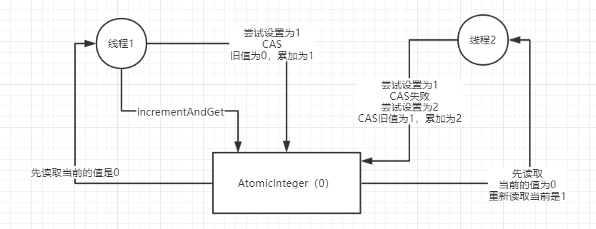
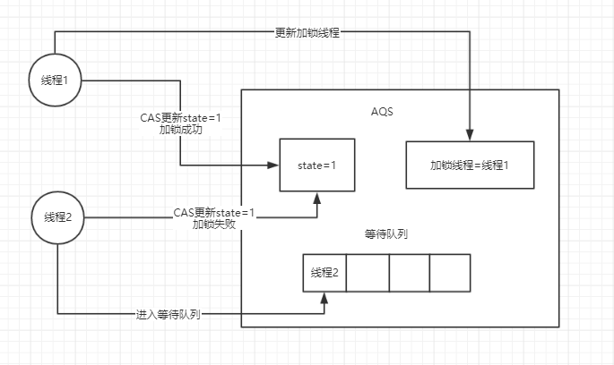
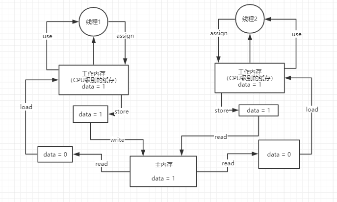

### 1.说说synchronized关键字的底层原理是什么？

synchronized底层的原理，是跟jvm指令和monitor有关系的

如果我们用到了synchronized关键字，在底层编译后的JVM指令中，会有monitorenter和monitorexit两个指令

加锁执行monitorenter指令，释放锁执行monitorexit指令

那么执行monitorenter指令的时候会干些什么了？

每个对象都有一个关联的monitor，比如一个对象实例就有一个monitor，一个类的Class对象也有一个monitor，如果要对这个对象加锁，那么必须获取这个对象关联的monitor的lock锁

monitor里面有一个计数器，从0开始的。如果一个线程要获取monitor的锁，就看看他的计数器是不是0，如果是0的话，那么说明没人获取锁，他就可以获取锁了，然后对计数器加1

PS：monitor的锁是支持重入加锁的

如果一个线程第一次synchronized那里，获取到了myObject对象的monitor的锁，计数器就加1，然后第二次synchronized那里，会再次获取myObject对象的monitor的锁，这个就是重入加锁了，然后计数器会再次 加1，变成2

这个时候，其他的线程在第一次synchronized那里，会发现myObject对象的monitor锁的计数器是大于0的，意味着被别人加锁了，然后此时线程就会进入block阻塞状态，什么都干不了，就等着获取锁

如果出了synchronized修饰的代码片段的范围，就会有一个monitorexit的指令，在底层，此时获取锁的线程就会对那个对象的monitor的计数器减1，如果有多次重入锁就会对应对此减一，直到最后，计数器为0

然后后面block阻塞的线程，就会去争取锁，不过只有一个可以获得 锁成功

### 2.能聊聊你对CAS的理解以及其底层实现原理可以吗？

我们平时代码中的i++操作，如果考虑线程安全问题，那么我们可以使用原子操作类AutomicInteger，这个原子操作类的底层就是基于CAS来进行实现的

CAS：compare and swap

CAS在底层的硬件级别给你保证一定是原子的，同一时间只有一个线程可以执行CAS，先比较再替换，其他线程的CAS同时间去执行此时会失败



### 3.ConCurrentHashMap实现线程安全的底层原理到底是什么？

在jdk1.7以及之前的版本里，是分段加锁

它会拆分成很多个数组，[数组1],[数组2],[数组3]->每个数组都对应一个锁，分段加锁

//多个线程过来，线程1要put的位置是数组1[5],线程2要put的位置是数组2[21]

JDK1.8以后，做了优化和改进，锁粒度的细化

变成了[一个大的数组]，数组里每个元素进行put操作，都是有一个不同的锁，刚开始进行put的时候，如果两个线程都是在数组[5]这个位置进行put，这个时候，采取的是CAS的策略

同一时间，只有一个线程能执行成功这个CAS，就是说它刚开始先获取 下数组[5]这个位置的值，null，然后执行CAS，比较下，put进去我要放的数据，同时间，其他线程执行CAS都会失败

通过对数组每个元素执行CAS策略，如果是很多线程对数组里不同的元素执行put，大家是没有关系的，当发现数组[5]这个位置已经有人放进去值了，就需要在这个位置基于链表加红黑树来处理，会把数组[5]这个位置synchronized，加锁，基于链表和红黑树在这个位置插进去自己的数据

对数组里的同一个位置的元素进行操作，才会加锁串行化处理；如果是对数组不同位置的元素操作，此时大家可以并发执行

### 4.你对JDK中的AQS理解吗？AQS的实现原理是什么？

多线程同时访问一个共享数据的时候，我们可以使用synchronized，CAS，ConcurrentHashMap（并发安全的数据结构），Lock

ReentrantLock lock = new ReentrantLock();

lock.lock();

lock.unlock();

Lock就是基于AQS(Abstract Queue Synchronized:抽象队列同步器)的原理来实现的



 

 当线程1释放锁，state更新为0，加锁线程置为null，线程1会去唤醒线程2，但此时线程2不一定能获得锁，因为可能这个时候有个线程3来竞争锁并且获得锁，所以ReentrantLock lock = new ReentrantLock()这是个非公平锁。

如果我们换种构造方法ReentrantLock lock = new ReentrantLock(true)；

这个时候线程3会先去看队列中是否有人排队，如果有人，那么它就不会去竞争锁，会进入等待队列中进行排队等待

### 5.说说线程池的底层工作原理可以吗？

比如我们有一个corePoolSize为3的线程池

提交任务，先看下线程池里的线程数量是否小于corePoolSize，也就是3，如果小于，直接创建一个线程出来执行你的任务

执行完任务以后，这个线程是不会死掉的，他会尝试从一个LinkedBlockingQueue里获取新的任务，如果没有新的任务，此时就会阻塞住，等待新的任务到来

持续提交任务，上述流程反复执行，只要线程池的线程数量小于corePoolSize，都会直接创建新的线程来执行这个任务，执行完了就尝试从无界队列里获取任务，直到线程池里有corePoolSize个线程

接着再次提交任务，会发现线程数量已经跟corePoolSize一样大了，此时就直接把任务放入队列中就可以了，线程会争抢获取任务执行，如果所有的线程此时都在执行任务，那么无界队列里的任务就可能会越来越多

### 6.那你说说线程池的核心配置参数都是干什么的？平时我们应该怎么用

```java
return new ThreadPoolExecutor(nThreads,
                              nThreads,
                              0L,
                              TimeUnit.MILLISECONDS,
                              new LinkedBlockingQueue<Runnable>()

 ) ; 
```

代表线程池的类就是ThreadPoolExecutor

创建一个线程池就是这样，corePoolSize，maximumPoolSize,keepAliveTime,queue这几个东西，如果不用fixed之类的线程池，自己完全可以通过构造函数创建自己的线程池

corePoolSize：3

maximumPoolSize:20

keepAliveTime:60s

new ArrayBlockingQueue<Runnable>(200)

把queue做成有界队列，比如说new ArrayBlockingQueue<Runnable>(200),那么假设corePoolSize个线程都在繁忙的工作，大量任务进入有界队列，队列满了，此时怎么办？

如果我的maximumPoolSize是比corePoolSize大的，此时会继续创建额外的线程放入线程池里，来处理这些任务，这些额外的线程，如果处理完了任务也会尝试从队列里去获取任务来执行

如果额外的线程都创建完了去处理任务，达到了20个，队列还是满的，此时有新的任务过来怎么办？只能reject掉，有几种reject策略，可以传入RejectedExecutionHandler

（1）AbortPolicy ：抛异常

（2）DiscardPolicy ：任务忽略掉

（3）DiscardOldestPolicy ：抛弃最旧的任务

（4）CallerRunsPolicy  ：不进入线程池执行

（5）自定义

如果后续慢慢的队列里没有任务了，线程空闲了，超过corePoolSize的线程（额外线程）会自动释放掉，在keepAliveTime之后就会释放。

我们常用的就是newFixedThreadPool线程池

### 7.如果在线程池中使用无界阻塞队列会发生什么问题？

相关面试题：在远程服务异常的情况下，使用无界阻塞队列，是否会导致内存异常飙升？

调用超时，队列变得越来越大，此时会导致内存飙升起来，而且还可能会导致OOM，内存溢出

### 8.你知道如果线程池的队列满了之后，会发生什么事情吗？

线程池的队列会满我们肯定使用的是有界队列，这个地方就要提到两个线程池参数，corePoolSize和maximumPoolSize，当线程池队列满了以后，就会再创建额外的线程，直到数量达到maximumPoolSize的值，这些额外线程就会去执行后续过来的任务，线程执行完任务后也会去执行队列里面的任务。

### 9.如果线上机器突然宕机，线程池的阻塞队列中的请求怎么办？

宕机必然会导致线程池里积压的任务实际上来说都是会丢失的

解决办法就是如果说你要提交一个任务到线程池里去，在提交之前，先在数据库里插入这个任务的信息，更新他的状态：未提交，已提交，已完成。提交成功以后，更新他的状态是已提交状态

系统重启，后台线程去扫描数据库里的未提交和已提交状态的任务，可以把任务的信息读取出来，重新提交到线程池里去，继续进行执行

### 10.谈谈你对java内存模型的理解可以吗？



 

 理解java内存模型要知道它的主内存和工作内存，还有它的六个步骤read，load，user，assign（分配），store（存储），write

以最普遍的data++举例，线程1读取主内存中的data对象，加载到工作内存中，线程1使用过后，再assign给工作内存，然后再store data = 1，最后写入到主内存中

### 11.你知道java内存模型中的原子性，有序性，可见性是什么吗？

可见性：根据图来说明，当一个线程更新玩数据以后，强制其他线程重新去主内存读取数据，这就叫有可见性

原子性：还是根据图来说明，图中两个线程，当线程1执行read，load。。。六步操作的时候，线程2是不能进行操作的，这就叫原子性，不过data++是不具备原子性的

有序性：对于代码，同时还有一个问题是指令重排序，编译器和指令器，有的时候为了提高代码执行效率，会将指令重排序，具备有序性，不会发生指令重排导致代码异常；不具备有序性，可能会发生一些指令重排，导致代码可能会出现一些问题

### 12.能从java底层角度聊聊volatile关键字的原理吗？

volatile关键字是用来解决可见性和有序性，它并不保证原子性

可见性是因为从内存模型图中理解，当线程1更新完数据后，会强制线程2的工作模型中的数据失效，这个时候线程2就会重新去主内存中读取线程1更新的数据，这个就是可见性

有序性是因为volatile 其本身包含“禁止指令重排序”的语义

### 13.你知道指令重排和happens-before原则是什么吗？

java中有一个happens-before原则：编译器，指令器可能对代码重排序，乱排，要守一定的规则，只要符合happens-before的原则，那么就不能胡乱重排，如果不符合这些规则的话，那就可以自己排序

1.程序次序规则：一个线程内，按照代码顺序，书写在前面的操作先行发生于书写在后面的操作

2.锁定规则：一个unlock操作先行发生于后面对同一个锁的lock操作

3.volatile变量规则：对一个volatile变量的写操作先行发生于后面对这个volatile变量的读操作，volatile变量写，再是读，必须保证是先写再读

4.传递规则：如果操作A先行发生于操作B，而操作B又先行发生于操作C，则可以得出操作A先行发生于操作C

5.线程启动规则：Thread对象的start()方法先行发生于此线程的每个一个动作，thread.start(),thread.interrupt()

6.线程中断规则：对线程interrupt（）方法的调用先行发生于被中断线程的代码检测到中断事件的发生

7.线程终结规则：线程中所有的操作都先行发生于线程的终止检测，我们可以通过Thread.join()方法结束，Thread.isAlive()的返回值手段检测到线程已经终止执行

8.对象终结规则：一个对象的初始化完成先行发生于他的finalize()方法的开始

上述8条原则的意思很显而易见，程序的代码如果满足这些条件，就一定会按照规则来保证指令的顺序

规则制定了在一些特殊情况下，不允许编译器，指令器对你写的代码进行指令重排，必须保证你的代码的有序性

但如果没满足上面的规则，那么可能会出现指令重排。

### 14.volatile底层是如何基于内存屏障保证可见性和有序性的？

1.lock指令：volatile保证可见性

对volatile修饰的变量，执行写操作的话，JVM会发送一条lock前缀指令给CPU，CPU在计算完之后会立即将这个值写回主内存，同时因为有MESI缓存一致性协议，所以各个CPU都会对总线进行嗅探，自己本地 缓存中的数据是否被别人修改

如果发现别人修改了某个缓存的数据，那么CPU就会将自己本地缓存的数据过期掉，然后这个CPU上执行的线程在读取那个变量的时候，就会从主内存重新加载最新的数据了

2.内存屏障：禁止指令重排序